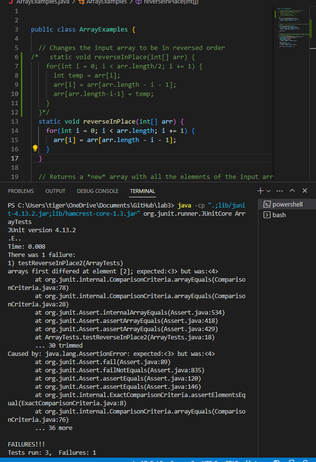
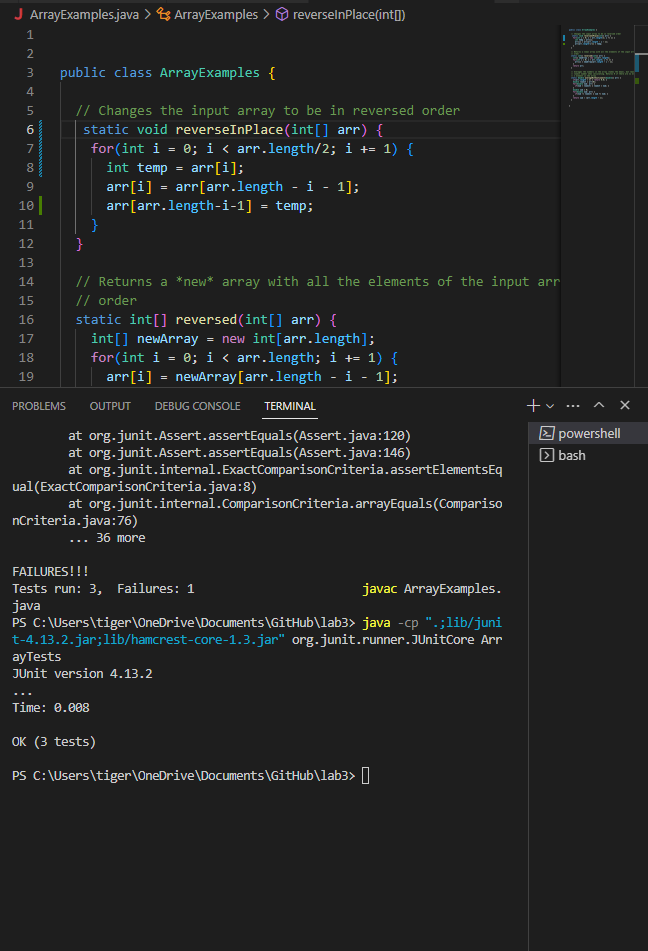

#Part 1:


#Part 2:

The test:
This test checks to see if a length 4 list will properly reverse itself after going through reverseInPlace and store the new version of the list in the old variable.
```
@Test
public void testReverseInPlace2(){
  int[] input1 = {2,3,4,5};
  int[] reversed = {5,4,3,2};
  ArrayExamples.reverseInPlace(input1);
  assertArrayEquals(reversed, input1);
 }
```

Before
```
static void reverseInPlace(int[] arr) {
    for(int i = 0; i < arr.length; i += 1) {
      arr[i] = arr[arr.length - i - 1];
    }
  }
 ```


As you can see the original test failed because the first value of the the array was wrong. In order to fix this I  shortend the length of the loop by half and add a holder in temp that holds the current indexs original valure so that not only is the first half replaced by the back but the back also gets the front number.

After
```
  static void reverseInPlace(int[] arr) {
    for(int i = 0; i < arr.length/2; i += 1) {
      int temp = arr[i];
      arr[i] = arr[arr.length - i - 1];
      arr[arr.length-i-1] = temp;
    }
  }
```



#Part 3:
In week two I learned how to start a server and get it to display text. Before the lab I did not know how to start a server or  how to or how to create code that changed the information in the server.
