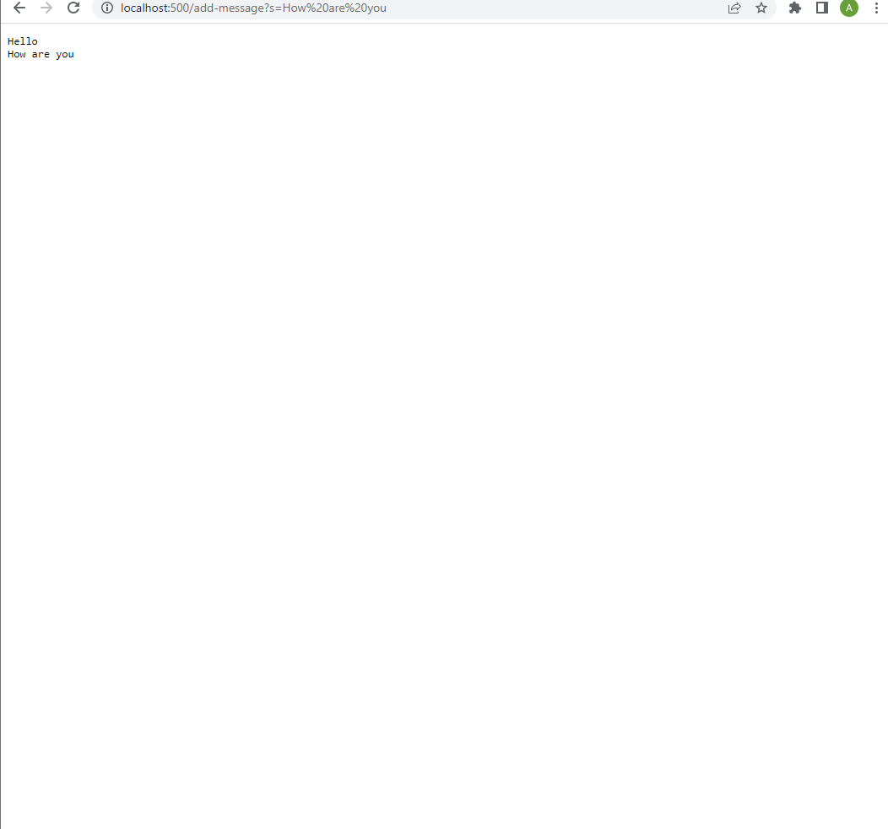

#Part 1:





#Part 2:

The test:
```
@Test
public void testReverseInPlace2(){
  int[] input1 = {2,3,4,5};
  int[] reversed = {5,4,3,2};
  ArrayExamples.reverseInPlace(input1);
  assertArrayEquals(reversed, input1);
 }
```

Before
```
static void reverseInPlace(int[] arr) {
    for(int i = 0; i < arr.length; i += 1) {
      arr[i] = arr[arr.length - i - 1];
    }
  }
 ```

After
```
  static void reverseInPlace(int[] arr) {
    for(int i = 0; i < arr.length/2; i += 1) {
      int temp = arr[i];
      arr[i] = arr[arr.length - i - 1];
      arr[arr.length-i-1] = temp;
    }
  }
```

#Part 3:
In week two I learned how to start a server and get it to display text. Before the lab I did not know how to start a server or  how to or how to create code that changed the information in the server.
