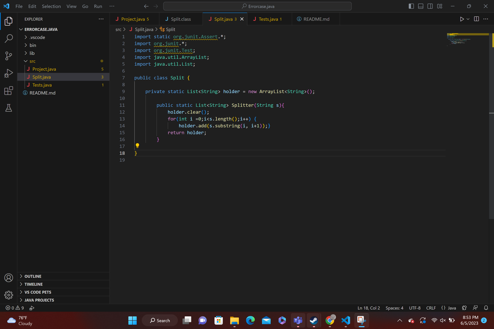
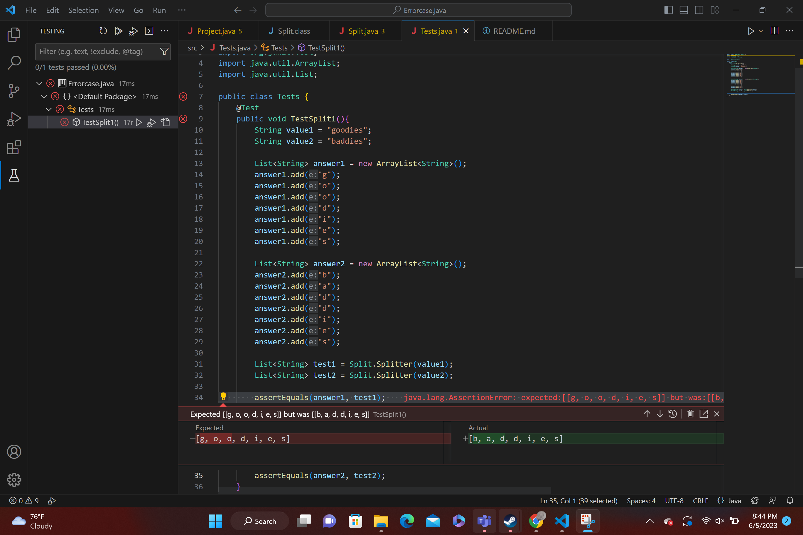

**What environment are you using (computer, operating system, web browser, terminal/editor, and so on)?**

I am using a laptop running Windows 11 and working on Visual Studio Code.

**Detail the symptom you're seeing. Be specific; include both what you're seeing and what you expected to see instead. Screenshots are great, copy-pasted terminal output is also great. Avoid saying “it doesn't work”.**
After testing the Splitter function to see if I get the correct values for to strings after running it twice Iget an error where the first test fails and instead of getting a list of the first word it gave a list of the second.

Splitter function: 

**Detail the failure-inducing input and context. That might mean any or all of the command you're running, a test case, command-line arguments, working directory, even the last few commands you ran. Do your best to provide as much context as you can.**
the input for my test can be seen in this picture below:

---
TA:
Looking at your issue  it seems that the problem stems from a misplacement of your holder method. Because you are not creating a new instance you are instead creating refference to the changing holder. It should instead look more like this
'''
        public static List<String> Splitter(String s){
            List<String> holder = new ArrayList<String>();
            for(int i =0;i<s.length();i++) {
                holder.add(s.substring(i, i+1));}
            return holder;
        }
 '''   
  ---
  Result:
